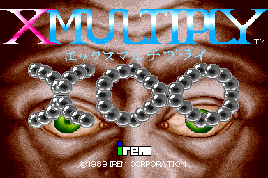

# X-Multiply Arcade Game

The game centers around an unusual alien invasion against a colony planet in the year 2249—the aliens themselves are microscopic creatures that invade, infect, and kill the colonists. Scientists have deployed the microscopic fighter X-002 into the body of the hapless woman whose body has been invaded by the alien queen.

## Zinnamon Team

<em>Pol Cortés, Rafel Brau, Èric Canela, Ferran Barnés</em>
- Management
  - Rafel Brau
    - [Github](https://github.com/Rafefix)
- Art & Design
  - Pol Cortés 
    - [Github](https://github.com/PolCorTs)
- Code
  - Èric Canela
    - [Github](https://github.com/knela96)
- QA
  - Ferran Barnés
    - [Github](https://github.com/FBarnes99)
  
  

## Gameplay
<iframe width="560" height="315" src="https://www.youtube.com/watch?v=kjk-0S6GrY4&feature=emb_title" frameborder="0" allow="accelerometer; autoplay; encrypted-media; gyroscope; picture-in-picture" allowfullscreen></iframe>

## Link to download the latest version of the game  
  [CLICK HERE](https://github.com/knela96/Project1/releases/tag/v1.0)

## For more information, see our wiki page
  [CLICK HERE](https://github.com/knela96/Project1/wiki)

## Link to our github reporitory
  [CLICK HERE](https://github.com/knela96/Project1)

